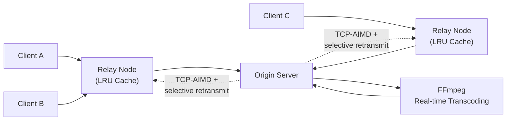

# 🎥 Adaptive Video Streaming Framework

A Java-based adaptive video streaming system using a hierarchical client-server-relay architecture, with custom congestion control, real-time transcoding, and multi-threaded session management for concurrent client scalability.


<!-- 📸 Add a screenshot of the client player, a throughput/latency graph, or an architecture demo here -->
<!--  -->

---

## Overview

This project implements an adaptive video streaming pipeline from scratch — not on top of an existing streaming SDK — covering transport-layer reliability, real-time transcoding, and distributed session scaling. It was built to explore how systems like YouTube/Twitch actually handle bitrate adaptation and packet loss under real network conditions, at a smaller, controllable scale.

The system sustains playback at **~40 FPS** while adapting quality dynamically to network conditions.

## Features

- **Hierarchical client-server-relay architecture** — relay nodes sit between clients and the origin server to reduce direct-connection load and enable regional caching
- **TCP-AIMD-based congestion control** — custom Additive-Increase/Multiplicative-Decrease implementation to adapt sending rate to network conditions
- **Selective retransmission** — only lost/corrupted packets are retransmitted instead of full segments, reducing recovery overhead
- **Real-time frame-level transcoding via FFmpeg** — bitrate adapts on the fly based on client bandwidth, reducing playback latency
- **Multi-threaded session management** — supports concurrent clients without blocking, each session handled independently
- **LRU-based caching at intermediary (relay) nodes** — frequently requested segments are cached closer to clients to improve throughput and reduce origin server load

## Tech Stack

| Component | Technology |
|---|---|
| Core language | Java |
| Transcoding | FFmpeg |
| Concurrency | Java multi-threading (per-session handling) |
| Transport reliability | Custom TCP-AIMD congestion control + selective retransmission |
| Caching | LRU cache at relay nodes |

## Architecture



## How It Works

1. **Client requests a stream** — the request is routed through the nearest relay node rather than hitting the origin server directly.
2. **Relay cache check (LRU)** — if the requested segment is cached, it's served immediately; otherwise the relay forwards the request upstream.
3. **Transcoding** — FFmpeg transcodes the source video in real time at the bitrate appropriate for the client's current bandwidth.
4. **Transport layer** — segments are sent using a custom TCP-AIMD scheme: the send rate increases gradually under good conditions and backs off multiplicatively on packet loss, with only the lost packets selectively retransmitted (not the whole segment).
5. **Session handling** — each client connection is managed on its own thread, so one slow/congested client doesn't block others.

## Getting Started

### Prerequisites
- Java 17+ (or your target JDK version)
- FFmpeg installed and available on `PATH`
- Maven or Gradle (whichever the project uses)

### Setup

```bash
git clone https://github.com/thejeesh007/<repo-name>.git
cd <repo-name>

# Build
mvn clean install    # or: ./gradlew build

# Run the server
java -jar server/target/server.jar --port 8080

# Run a relay node
java -jar relay/target/relay.jar --upstream localhost:8080 --port 9090

# Run a client
java -jar client/target/client.jar --relay localhost:9090
```

> Replace the module/jar paths above with your actual project structure before publishing.

## Results

| Metric | Value |
|---|---|
| Sustained playback rate | ~40 FPS |
| Retransmission strategy | Selective (lost packets only) |
| Congestion control | Custom TCP-AIMD |

<!-- Add throughput, latency, or concurrent-client-scale numbers here once benchmarked — this is the kind of systems project where numbers matter a lot in interviews -->

## Roadmap
- [ ] Benchmark concurrent client scaling limits (e.g. max clients per relay before degradation)
- [ ] Add adaptive bitrate ladder (multiple quality tiers, not just single-stream adaptation)
- [ ] Visualize congestion window behavior over time

## Author
**Thejeesh G** — [LinkedIn](https://www.linkedin.com/in/thejeeshg/) · [GitHub](https://github.com/thejeesh007)

## License
MIT
